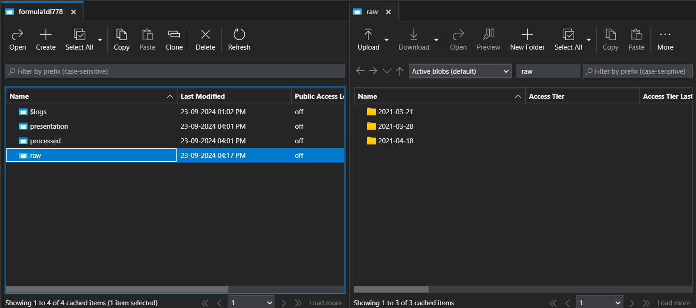
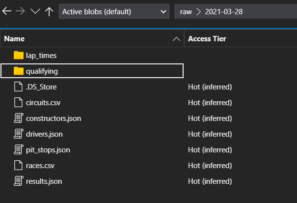
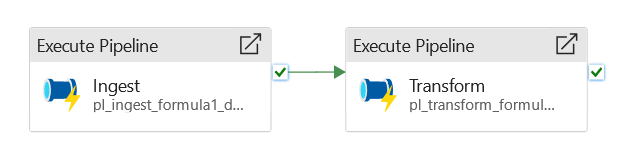
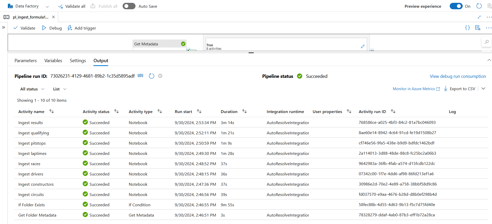
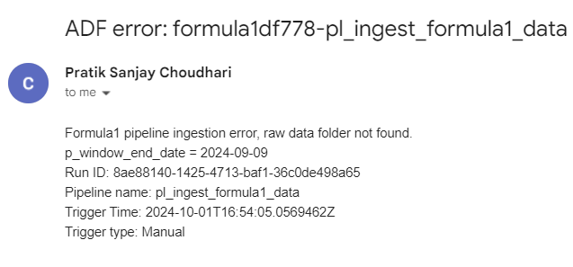
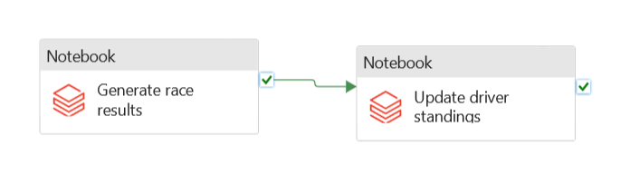
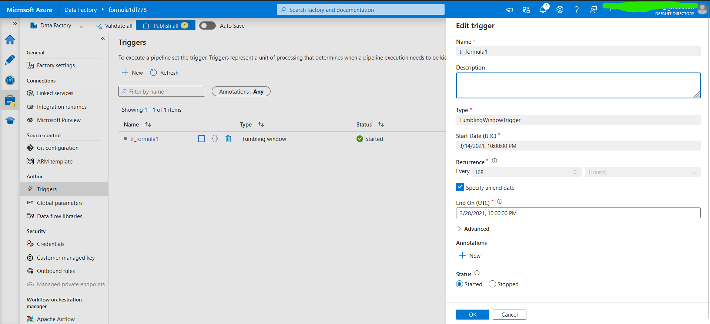

# Formula1-Data-Pipeline
An end-to-end formula1 data pipeline built with Azure Databricks, Azure Data Factory, and Apache Spark.

<p align="center">
    
</p>

## Table of Contents

1. [Architecture](#architecture)
2. [Data Flow](#data-flow)
3. [Storage and Files](#storage-and-files)
4. [Pipelines](#data-factory-pipelines)
5. [Trigger](#trigger)
6. [Sample Trigger Execution](#triggered-execution-video)

## Architecture

<p align="center">
   
</p>

## Data Flow

1. Ingestion
   - For each F1 race, a new folder is created in the raw data layer, containing race-specific files and folders.
   - An ADF trigger schedules and executes a notebook pipeline, moving the raw data to the processed layer in Delta Lake.

2. Transformation
   - After the raw data is processed, a transformation pipeline is initiated.
   - The transformation notebooks join, filter, and store the processed data in the presentation layer of the Delta Lake.

3. Analysis
   - Data can be queried using SparkSQL or the DataFrame API, enabling flexible data exploration.
   - Visualization tools like Power BI can connect to the Delta Lake to generate dashboards and reports.
<br>

## Storage and Files



The raw data is stored in a folder labeled with the date of the race. The contents of the folder are listed below.



- Drivers, constructors, races, and circuits are processed using a full-load approach, where the data is overwritten in each iteration.
- Results, pit stops, lap times, and qualifying are processed incrementally, with the data being cleaned, formatted, and merged with the existing records.
- Therefore, this solution employs a hybrid data ingestion approach.

## Data Factory Pipelines

### Main Pipeline



### Ingestion Pipeline


Debugging the pipeline:



#### Activities:

1. Get Metadata
   - Connects to blob storage using a linked service to verify whether a folder for the current run exists in the raw container.
   - The output includes an `Exists` flag.

2. If Condition
   - Uses the output from the Get Metadata activity.
   - If the `output.exists` flag is true, the following pipeline is executed. All files are available [here](./ingestion).  
     

   - If the flag is false, a Logic App is triggered to send a failure email to a specific email address.  
     <div style="display: flex; flex-direction: row; justify-content: space-evenly">
        
        
     </div>

   - Error Email
     

### Transformation Pipeline



#### Activities:

1. Databricks Notebook
   - Run the [race_results](./transform/race_results.py) Databricks notebook to create the `race_results` Delta table in the presentation layer.
   - This table is generated by joining and filtering data from four processed layer tables: races, circuits, drivers, and constructors.
   - The information in this table can be utilized to display a dashboard of results after each race.
2. Databricks Notebook
   - Run the [driver_standings](./transform/driver_standings.py) Databricks notebook to generate the `driver_standings` Delta table in the presentation layer.
   - Since the driver standings are derived from the `race_results` table, this process should only be executed after the successful completion of the race results transformation.
## Trigger



A tumbling window trigger with 168hrs/2w interval, end date specified and max concurrency set to 1.

Parameter configuration:
```json
{
  "p_window_end_date": "@trigger().outputs.windowEndTime"
}
```


## Triggered Execution (Video)

[](https://www.youtube.com/watch?v=f-cbAJRQi1E)