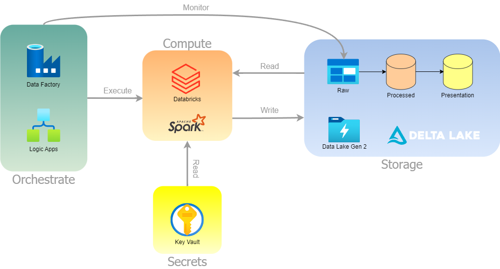
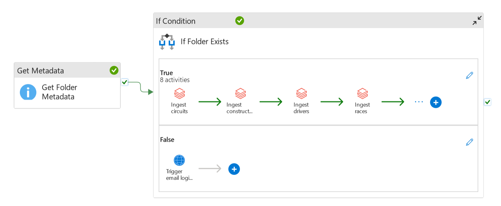
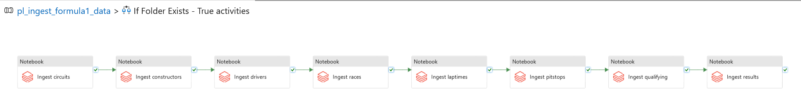
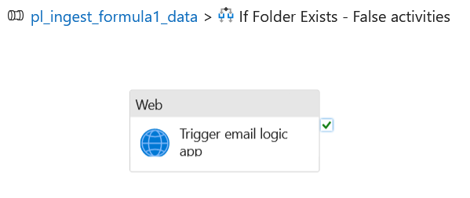
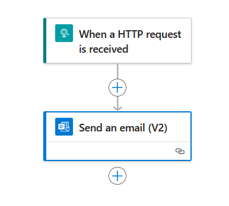

# Formula1-Data-Pipeline
An end-to-end formula1 data pipeline built with Azure Databricks, Azure Data Factory, and Apache Spark.

    

## Architecture

   

### Data flow:
1. Ingestion
   - For every F1 race, a new folder is generated in the raw data layer, containing 8 files specific to that race on a given date.
   - Azure Data Factory periodically monitors for the arrival of new data and, once detected, triggers a notebook pipeline. The raw data is then moved to the processed layer in the Delta Lake.
2. Transformation
   - Once the raw data is processed, a transformation pipeline is activated.
   - The transformation notebooks join, filter, and store the processed data in the presentation layer of the Delta Lake.
3. Analysis
   - Data can be queried using SparkSQL or the DataFrame API for flexible data exploration.
   - Visualization tools such as Power BI can connect to the Delta Lake to create dashboards and reports.
 

## Data Factory Pipelines

### Ingestion Pipeline

**If Condition - True**

**If Condition - False**

